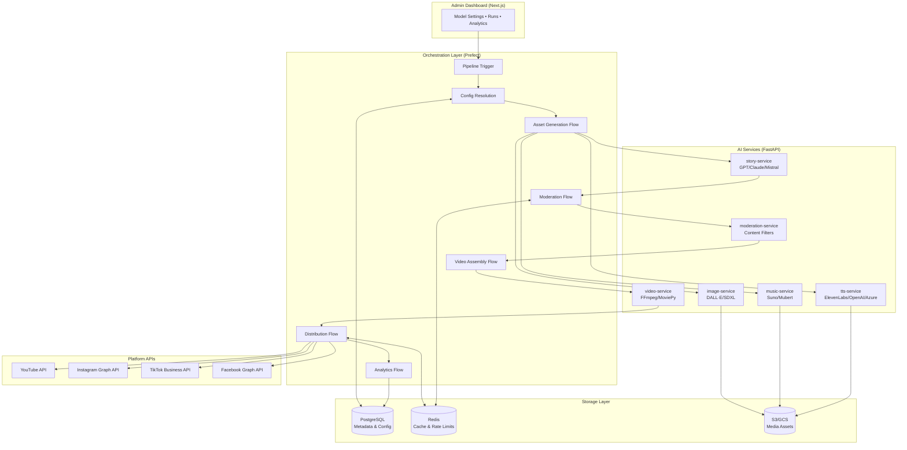
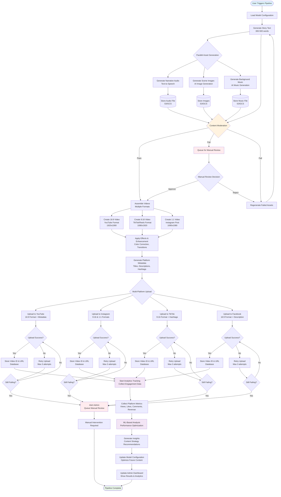

# Design Document

## Overview

The AI Story-to-Video Pipeline is a microservices-based system that automates the complete workflow from story generation to video distribution across multiple social media platforms. The system uses a hybrid architecture combining Python FastAPI microservices for AI processing, Next.js for the admin dashboard, Prefect for orchestration, and cloud storage for media assets.

The pipeline processes content through five main stages: asset generation, content moderation, video assembly, multi-platform distribution, and analytics tracking. Each stage is designed for reliability, scalability, and cost optimization while maintaining high content quality and compliance standards.

## Architecture

### Simple High-Level Flow

```mermaid
flowchart LR
    A[📝 Generate Story] --> B[🎵 Create Media<br/>Audio + Images + Music]
    B --> C[✅ Check Content<br/>Moderation]
    C --> D[🎬 Make Videos<br/>Multiple Formats]
    D --> E[📤 Upload to Platforms<br/>YouTube, TikTok, Instagram]
    E --> F[📊 Track Performance<br/>Analytics & Revenue]
    F --> G[🔄 Optimize<br/>Improve Future Content]
    
    style A fill:#e3f2fd
    style B fill:#f3e5f5
    style C fill:#fff3e0
    style D fill:#e8f5e8
    style E fill:#fce4ec
    style F fill:#f1f8e9
    style G fill:#e0f2f1
```



### Technical Architecture Overview



### Detailed Application Flow Diagram



### Microservices Architecture

The system is composed of specialized microservices, each handling a specific aspect of content generation:

**Core AI Services:**
- **story-service**: Generates narrative content using LLMs (GPT-4o, Claude, Mistral)
- **tts-service**: Converts text to speech using ElevenLabs, OpenAI TTS, or Azure Speech
- **music-service**: Generates background music using Suno or Mubert APIs
- **image-service**: Creates visual content using DALL·E 3 or Stable Diffusion XL
- **video-service**: Assembles final videos using FFmpeg/MoviePy with optional premium AI video generation

**Supporting Services:**
- **moderation-service**: Content filtering, copyright checking, and compliance validation
- **analytics-service**: Performance tracking and optimization recommendations
- **config-service**: Centralized model configuration and A/B testing management

## Components and Interfaces

### 1. Admin Dashboard (Next.js Frontend)

**Purpose**: Provides administrative interface for system configuration, monitoring, and analytics as a Backend-for-Frontend (BFF) layer.

**Architecture Pattern**: Next.js serves as a thin BFF that handles UI rendering, authentication cookies, and proxying to Python FastAPI services. All business logic remains in the Python microservices layer.

**Key Components:**
- **Model Configuration Panel**: Manage AI model settings, defaults, and constraints
- **Pipeline Monitor**: Real-time status of content generation pipelines
- **Analytics Dashboard**: Performance metrics, revenue tracking, and optimization insights
- **Content Review Queue**: Manual review interface for flagged content

**Next.js Implementation Guardrails:**

1. **Rendering Strategy**:
   - Prefer Client-Side Rendering (CSR) for admin pages
   - Use Server-Side Rendering (SSR) only when necessary
   - Avoid complex server-side logic in Route Handlers

2. **API Architecture**:
   - Next.js Route Handlers only proxy requests to Python FastAPI services
   - No business logic in Next.js - all heavy lifting in Python services
   - Manage httpOnly auth cookies and session state only

3. **Performance & Observability**:
   - Ship logs/metrics to existing monitoring stack (Prometheus/Grafana)
   - Avoid opaque Next.js runtime features that are hard to debug
   - Use structured logging with correlation IDs

4. **Deployment**:
   - Self-host on Node.js (ECS/Kubernetes) - no Vercel lock-in
   - Deploy behind CDN with aggressive static asset caching
   - Containerized deployment alongside other services

**API Interfaces:**
```typescript
// Configuration Management (proxied to Python services)
POST /api/config/models - Update model configurations
GET /api/config/models - Retrieve current model settings
POST /api/config/ab-test - Create A/B test configurations

// Pipeline Management (proxied to Prefect/Python services)
POST /api/pipeline/start - Trigger new content generation
GET /api/pipeline/status/{id} - Get pipeline execution status
POST /api/pipeline/stop/{id} - Cancel running pipeline

// Analytics (proxied to analytics service)
GET /api/analytics/performance - Retrieve performance metrics
GET /api/analytics/revenue - Get revenue reports
GET /api/analytics/optimization - Fetch ML-based recommendations

// Authentication (handled by Next.js)
POST /api/auth/login - User authentication
POST /api/auth/logout - User logout
GET /api/auth/session - Get current session
```

**Technology Stack:**
- **Framework**: Next.js 14+ with App Router
- **Styling**: Tailwind CSS
- **State Management**: React Query for server state, Zustand for client state
- **Authentication**: NextAuth.js with JWT tokens
- **Real-time Updates**: WebSockets for pipeline status monitoring

### 2. Orchestration Layer (Prefect)

**Purpose**: Manages workflow execution, task scheduling, and error handling across the entire pipeline.

**Key Flows:**
- **Asset Generation Flow**: Coordinates parallel generation of story, audio, images, and music
- **Moderation Flow**: Validates content compliance before video assembly
- **Video Assembly Flow**: Combines assets into multiple video formats
- **Distribution Flow**: Uploads videos to multiple platforms with retry logic
- **Analytics Flow**: Collects and processes performance data

**Flow Configuration:**
```python
@flow(name="content-generation-pipeline")
def content_generation_pipeline(config: PipelineConfig):
    # Asset generation (parallel execution)
    story_task = generate_story.submit(config.story_params)
    
    # Wait for story before generating dependent assets
    story_result = story_task.result()
    
    # Parallel asset generation
    audio_task = generate_audio.submit(story_result, config.tts_params)
    images_task = generate_images.submit(story_result, config.image_params)
    music_task = generate_music.submit(config.music_params)
    
    # Content moderation
    moderation_result = moderate_content.submit(
        story_result, images_task.result(), music_task.result()
    )
    
    if moderation_result.result().approved:
        # Video assembly
        videos = assemble_videos.submit(
            story_result, audio_task.result(), 
            images_task.result(), music_task.result()
        )
        
        # Distribution
        upload_results = distribute_videos.submit(videos.result())
        
        # Analytics tracking
        track_analytics.submit(upload_results.result())
```

### 3. AI Services Layer

#### Story Service
**Technology**: FastAPI + LangChain
**Models**: GPT-4o (primary), Claude-3.5-Sonnet (fallback), Mistral-Large (cost-optimized)

```python
@app.post("/generate/story")
async def generate_story(request: StoryRequest) -> StoryResponse:
    """Generate story content with specified parameters"""
    
@app.post("/generate/metadata")  
async def generate_metadata(story: str, platform: str) -> MetadataResponse:
    """Generate platform-specific titles, descriptions, hashtags"""
```

#### TTS Service
**Technology**: FastAPI + Audio Processing Libraries
**Providers**: ElevenLabs (premium), OpenAI TTS (balanced), Azure Speech (enterprise)

```python
@app.post("/synthesize/speech")
async def synthesize_speech(request: TTSRequest) -> AudioResponse:
    """Convert text to speech with voice customization"""
    
@app.get("/voices/available")
async def get_available_voices() -> List[Voice]:
    """Retrieve available voice options"""
```

#### Image Service  
**Technology**: FastAPI + PIL/OpenCV
**Providers**: DALL·E 3 (primary), Stable Diffusion XL (fallback)

```python
@app.post("/generate/images")
async def generate_images(request: ImageRequest) -> ImageResponse:
    """Generate story-based images with scene descriptions"""
    
@app.post("/process/images")
async def process_images(images: List[str]) -> ProcessedImageResponse:
    """Apply filters, resizing, and optimization"""
```

#### Video Service
**Technology**: FastAPI + FFmpeg + MoviePy
**Capabilities**: Multi-format assembly, transitions, effects, subtitle overlay

```python
@app.post("/assemble/video")
async def assemble_video(request: VideoAssemblyRequest) -> VideoResponse:
    """Combine assets into final video with multiple format outputs"""
    
@app.post("/apply/effects")
async def apply_effects(video_id: str, effects: List[Effect]) -> VideoResponse:
    """Apply color correction, transitions, and visual enhancements"""
```

### 4. Storage Layer

#### PostgreSQL Database Schema

```sql
-- Core content entities
CREATE TABLE stories (
    id UUID PRIMARY KEY,
    content TEXT NOT NULL,
    genre VARCHAR(50),
    theme VARCHAR(100),
    word_count INTEGER,
    generation_params JSONB,
    created_at TIMESTAMP DEFAULT NOW()
);

CREATE TABLE media_assets (
    id UUID PRIMARY KEY,
    story_id UUID REFERENCES stories(id),
    asset_type VARCHAR(20) NOT NULL, -- 'audio', 'image', 'music'
    file_path VARCHAR(500),
    metadata JSONB,
    created_at TIMESTAMP DEFAULT NOW()
);

CREATE TABLE videos (
    id UUID PRIMARY KEY,
    story_id UUID REFERENCES stories(id),
    format VARCHAR(10) NOT NULL, -- '16:9', '9:16', '1:1'
    resolution VARCHAR(20),
    file_path VARCHAR(500),
    duration_seconds INTEGER,
    status VARCHAR(20) DEFAULT 'processing',
    created_at TIMESTAMP DEFAULT NOW()
);

CREATE TABLE platform_uploads (
    id UUID PRIMARY KEY,
    video_id UUID REFERENCES videos(id),
    platform VARCHAR(20) NOT NULL,
    platform_video_id VARCHAR(100),
    upload_url VARCHAR(500),
    status VARCHAR(20) DEFAULT 'pending',
    metadata JSONB,
    uploaded_at TIMESTAMP
);

CREATE TABLE analytics_data (
    id UUID PRIMARY KEY,
    upload_id UUID REFERENCES platform_uploads(id),
    metrics JSONB NOT NULL,
    revenue_data JSONB,
    collected_at TIMESTAMP DEFAULT NOW()
);

-- Configuration management
CREATE TABLE model_configurations (
    id UUID PRIMARY KEY,
    config_name VARCHAR(100) NOT NULL,
    model_settings JSONB NOT NULL,
    is_active BOOLEAN DEFAULT false,
    version INTEGER DEFAULT 1,
    created_at TIMESTAMP DEFAULT NOW()
);
```

#### Redis Cache Structure

```redis
# Rate limiting
rate_limit:story_service:{user_id} -> count, ttl
rate_limit:image_service:{user_id} -> count, ttl

# Configuration caching  
config:models:active -> JSON configuration
config:ab_test:{test_id} -> test parameters

# Pipeline status tracking
pipeline:{pipeline_id}:status -> current status
pipeline:{pipeline_id}:progress -> completion percentage

# Cost tracking
cost:daily:{date} -> total cost
cost:video:{video_id} -> individual video cost
```

## Data Models

### Core Domain Models

```python
from pydantic import BaseModel
from typing import List, Optional, Dict, Any
from enum import Enum

class ContentStatus(str, Enum):
    PENDING = "pending"
    PROCESSING = "processing" 
    COMPLETED = "completed"
    FAILED = "failed"
    MODERATION_REQUIRED = "moderation_required"

class Story(BaseModel):
    id: str
    content: str
    genre: Optional[str]
    theme: Optional[str]
    word_count: int
    generation_params: Dict[str, Any]
    status: ContentStatus
    created_at: datetime

class MediaAsset(BaseModel):
    id: str
    story_id: str
    asset_type: str  # 'audio', 'image', 'music'
    file_path: str
    metadata: Dict[str, Any]
    status: ContentStatus
    created_at: datetime

class Video(BaseModel):
    id: str
    story_id: str
    format: str  # '16:9', '9:16', '1:1'
    resolution: str
    file_path: str
    duration_seconds: int
    status: ContentStatus
    created_at: datetime

class PlatformUpload(BaseModel):
    id: str
    video_id: str
    platform: str
    platform_video_id: Optional[str]
    upload_url: Optional[str]
    title: str
    description: str
    hashtags: List[str]
    status: ContentStatus
    metadata: Dict[str, Any]
    uploaded_at: Optional[datetime]

class AnalyticsData(BaseModel):
    id: str
    upload_id: str
    views: int
    likes: int
    comments: int
    shares: int
    completion_rate: float
    revenue: Optional[float]
    collected_at: datetime
```

### Configuration Models

```python
class ModelConfiguration(BaseModel):
    story_model: str = "gpt-4o"
    tts_provider: str = "elevenlabs"
    image_model: str = "dall-e-3"
    music_provider: str = "mubert"
    video_quality: str = "high"
    
class PipelineConfig(BaseModel):
    story_params: Dict[str, Any]
    tts_params: Dict[str, Any]
    image_params: Dict[str, Any]
    music_params: Dict[str, Any]
    video_params: Dict[str, Any]
    moderation_enabled: bool = True
    platforms: List[str] = ["youtube", "instagram", "tiktok"]
```

## Error Handling

### Retry Strategy

The system implements a comprehensive retry strategy with exponential backoff:

```python
@retry(
    stop=stop_after_attempt(3),
    wait=wait_exponential(multiplier=1, min=4, max=10),
    retry=retry_if_exception_type((APIError, NetworkError))
)
async def call_ai_service(service_url: str, payload: dict):
    """Resilient AI service calls with retry logic"""
```

### Circuit Breaker Pattern

```python
class ServiceCircuitBreaker:
    def __init__(self, failure_threshold: int = 5, timeout: int = 60):
        self.failure_threshold = failure_threshold
        self.timeout = timeout
        self.failure_count = 0
        self.last_failure_time = None
        self.state = "CLOSED"  # CLOSED, OPEN, HALF_OPEN
```

### Error Recovery Flows

1. **Asset Generation Failures**: Automatic fallback to alternative AI providers
2. **Video Assembly Failures**: Retry with reduced quality settings
3. **Upload Failures**: Queue for manual review after exhausting retries
4. **Moderation Failures**: Default to manual review queue

## Testing Strategy

### Unit Testing
- **Coverage Target**: ≥80% code coverage
- **Framework**: pytest for Python services, Jest for Next.js frontend
- **Mock Strategy**: Mock external API calls, use test databases

```python
# Example unit test
@pytest.mark.asyncio
async def test_story_generation():
    mock_llm = Mock()
    mock_llm.generate.return_value = "Test story content"
    
    service = StoryService(llm=mock_llm)
    result = await service.generate_story(StoryRequest(theme="adventure"))
    
    assert result.content == "Test story content"
    assert result.word_count > 0
```

### Integration Testing
- **Scope**: End-to-end service interactions with mocked external APIs
- **Framework**: pytest-asyncio for async testing
- **Test Data**: Synthetic test content and media assets

### Performance Testing
- **Load Testing**: Simulate 100 concurrent video generations
- **Stress Testing**: Test system behavior under resource constraints
- **Tools**: Locust for load testing, custom metrics collection

### Security Testing
- **API Security**: Authentication, authorization, input validation
- **Secrets Management**: Verify proper handling of API keys and credentials
- **Content Security**: Test content filtering and moderation systems

## Deployment and Infrastructure

### Containerization
```dockerfile
# Example service Dockerfile
FROM python:3.11-slim

WORKDIR /app
COPY requirements.txt .
RUN pip install -r requirements.txt

COPY . .
EXPOSE 8000

CMD ["uvicorn", "main:app", "--host", "0.0.0.0", "--port", "8000"]
```

### Kubernetes Deployment
```yaml
apiVersion: apps/v1
kind: Deployment
metadata:
  name: story-service
spec:
  replicas: 3
  selector:
    matchLabels:
      app: story-service
  template:
    metadata:
      labels:
        app: story-service
    spec:
      containers:
      - name: story-service
        image: story-service:latest
        ports:
        - containerPort: 8000
        env:
        - name: DATABASE_URL
          valueFrom:
            secretKeyRef:
              name: db-secret
              key: url
```

### Monitoring and Observability
- **Metrics**: Prometheus + Grafana for system metrics
- **Logging**: Structured logging with ELK stack
- **Tracing**: Jaeger for distributed tracing
- **Alerting**: PagerDuty integration for critical failures

### Security Considerations
- **Secrets Management**: AWS Secrets Manager / GCP Secret Manager
- **Network Security**: VPC isolation, security groups
- **Authentication**: JWT-based API authentication
- **Content Security**: Input sanitization, output filtering
- **Compliance**: GDPR/COPPA data handling, audit logging

## Non-Functional Requirements & SLOs

- Latency SLOs (P95/P99)
  - Story: ≤ 20s / 40s
  - TTS (per minute): ≤ 60s / 90s
  - Image (per scene): ≤ 25s / 45s
  - Video assembly (2–5 min): ≤ 4m / 6m
  - Upload: ≤ 120s / 240s
- Availability: ≥99% monthly; error budgets per service
- Throughput: Burst 50 concurrent pipelines with backpressure

## RBAC, AuthZ, and Audit

- Roles: admin, operator, viewer
- Admin-only: model config writes, budget/policy changes, secrets rotation
- All admin actions audit logged with before/after diffs

## Budget & Quotas

- Provider budgets with circuit breakers; degrade policy Premium → Standard → Budget → Pause
- Platform quota calendars (e.g., YouTube units) with auto-deferral and resume
- Cost attribution per run/asset; Grafana/Sentry spend alerts

## Idempotency & Deduplication

- Run-level idempotency keys; safe orchestration replays
- Upload idempotency to prevent duplicate posts; checksum/title checks
- Media checksum registry to avoid duplicate storage/renders

## Licensing Evidence Store

- Persist music/image license receipts, prompts, timestamps, provider responses
- Block distribution if evidence missing/invalid

## Subtitles & Captions

- Generate SRT/VTT via ASR or TTS alignment; optional burn-in
- Multi-language captions; attach where platforms support

## Thumbnails & CTR Optimization

- Branded thumbnails with safe areas; two-variant A/B test and CTR feedback

## Internationalization (i18n)

- Multi-language stories, TTS, and metadata; locale mapping per platform
- Font packs and RTL support

## Governance & Compliance

- Kids mode policy preset; regional policy toggles
- Data retention windows (30/90/180 days) with lifecycle enforcement
- Right-to-delete flows; complete audit trails

## Storage & Disaster Recovery

- S3/GCS encryption-at-rest (KMS), integrity checksums, versioned objects
- Cross-region replication for critical artifacts; RPO ≤ 15m, RTO ≤ 60m

## Experimentation Framework

- Config bucketing, A/B assignment, metrics attribution, automated promotion rules

## Observability & Backpressure

- Correlation IDs, PII redaction, trace sampling
- Queue depth dashboards; provider-specific concurrency caps; request shedding

## Asset Versioning

- Versioned filenames/paths for re-renders; immutable metadata; lineage tracking

## Next.js Usage Guidelines

### Architecture Principles

**Next.js Role**: Thin Backend-for-Frontend (BFF) for admin dashboard only
- ✅ Handle UI rendering, authentication cookies, and request proxying
- ❌ No business logic, job processing, or data transformation
- ✅ Manage user sessions and route protection
- ❌ No direct database operations or AI service calls

### Implementation Standards

**Rendering Strategy**:
- Default to Client-Side Rendering (CSR) for admin interfaces
- Use Server-Side Rendering (SSR) only for SEO-critical pages (none expected)
- Avoid complex server-side computations in Route Handlers

**API Route Guidelines**:
```typescript
// ✅ Good: Simple proxy to Python service
export async function POST(request: Request) {
  const body = await request.json();
  const response = await fetch(`${PYTHON_API_URL}/pipeline/start`, {
    method: 'POST',
    headers: { 'Content-Type': 'application/json' },
    body: JSON.stringify(body)
  });
  return Response.json(await response.json());
}

// ❌ Bad: Business logic in Next.js
export async function POST(request: Request) {
  const story = await generateStoryWithLLM(request.body); // Don't do this
  const video = await processVideo(story); // Don't do this
  return Response.json({ video });
}
```

**Performance & Monitoring**:
- Integrate with existing Prometheus/Grafana stack
- Use structured logging with correlation IDs
- Avoid Next.js-specific monitoring that creates vendor lock-in
- Cache static assets aggressively via CDN

**Deployment Strategy**:
- Self-host on Node.js runtime (ECS, Kubernetes, or similar)
- Containerize alongside other microservices
- No dependency on Vercel or other Next.js-specific hosting
- Use standard reverse proxy (nginx) for routing

### Migration Path

If Next.js becomes problematic:
1. **Phase 1**: Replace with Vite + React SPA + thin Express BFF
2. **Phase 2**: Keep all Python FastAPI services unchanged
3. **Phase 3**: Minimal disruption to backend architecture

This approach ensures the frontend choice doesn't impact core business logic or system reliability.